# Waggle Architecture Deep Dive

This document provides a detailed breakdown of each internal module in the Waggle multi-agent orchestration framework.

## Module Overview

| Package | Purpose | Key Types |
|---------|---------|----------|
| `queen` | Central orchestrator - runs the autonomous LLM agent loop | `Queen`, `Phase`, `ToolHandler` |
| `llm` | Provider-agnostic LLM interface (Anthropic, OpenAI, Gemini, CLI) | `Client`, `ToolClient`, `ToolDef` |
| `task` | Task graph with dependency tracking & status management | `Task`, `TaskGraph`, `Status`, `Priority` |
| `worker` | Worker pool that spawns & monitors CLI processes | `Pool`, `Bee`, `Status` |
| `adapter` | CLI wrapper adapters (Claude, Kimi, Codex, etc.) | `Adapter`, `Registry`, `TaskRouter` |
| `bus` | In-process pub/sub event system | `MessageBus`, `Message`, `MsgType` |
| `blackboard` | Shared memory for inter-agent communication | `Blackboard`, `Entry` |
| `state` | SQLite persistence layer (WAL mode) | `DB` |
| `safety` | Path restriction & command filtering | `Guard` |
| `config` | Configuration management & defaults | `Config`, `QueenConfig`, `WorkerConfig` |
| `compact` | Context window compaction for long conversations | `Context`, `Message` |
| `errors` | Error classification & retry logic | `ErrorType`, `RetryableError`, `PermanentError` |
| `tui` | Bubble Tea terminal dashboard | `Model`, `TaskInfo`, `WorkerInfo` |
| `output` | Output mode management (TUI/Plain/JSON/Quiet) | `Manager`, `Mode`, `Printer` |

---

## Detailed Module Breakdown

### 1. `queen` - The Orchestrator 👑

**Files:** `queen.go`, `agent.go`, `tools.go`, `prompt.go`, `review.go`, `replan.go`

The Queen is the brain of Waggle. It's an autonomous tool-using LLM that:

- Receives objectives from the user
- Decomposes work into a task DAG using `create_tasks`
- Assigns tasks to workers via `assign_task`
- Monitors progress with `wait_for_workers` and `get_status`
- Reviews results using `get_task_output`, then `approve_task` or `reject_task`
- Inspects the codebase with `read_file` and `list_files`
- Declares success (`complete`) or failure (`fail`)

**Key Components:**
- `Queen` struct: Holds all dependencies (config, bus, DB, task graph, worker pool)
- `ToolHandler`: Function signature for tool implementations
- `toolHandlers` map: Routes tool names to handler functions
- `repairToolHistory()`: Fixes message history to ensure tool_use/tool_result pairing

**Agent Loop (agent.go):**
```
Receive objective → LLM call with tools → Execute tool calls → Feed results back → Repeat until complete/fail
```

---

### 2. `llm` - LLM Abstraction Layer 🧠

**Files:** `client.go`, `types.go`, `anthropic.go`, `openai.go`, `gemini.go`, `cli.go`, `factory.go`

Provider-agnostic interface for LLM communication:

- **`Client`**: Basic chat interface (`Chat`, `ChatWithHistory`)
- **`ToolClient`**: Extends Client with `ChatWithTools` for structured tool calling
- **Implementations**:
  - `AnthropicClient`: Native Claude API with tool-use
  - `OpenAIClient`: OpenAI-compatible API (works with Codex too)
  - `GeminiClient`: Google Gemini API with function calling
  - `CLIClient`: Wraps CLI tools (legacy mode, no tool-use)

**Key Types:**
- `ToolDef`: Tool schema (name, description, JSON schema)
- `ToolCall`: A call from the LLM (ID, name, input JSON)
- `ToolResult`: Result sent back (call ID, content, is_error)
- `Response`: Complete LLM response (content, stop reason, tool calls, usage)

---

### 3. `task` - Task Graph & Dependencies 📋

**Files:** `task.go`, `dag.go`

Manages the task graph with dependency tracking:

- **`Task`**: Single work unit with ID, type, status, description, constraints, dependencies
- **`TaskGraph`**: Thread-safe DAG of tasks with dependency resolution
- **`Status`**: `pending` → `assigned` → `running` → `complete`/`failed`/`retrying`
- **`Type`**: `code`, `research`, `test`, `review`, `generic`

**Key Methods:**
- `Add(task)`: Add task to graph
- `GetReady()`: Returns tasks with all dependencies satisfied
- `SetStatus()`: Transitions task state, publishes bus events
- `RenderDOT()`: Outputs Graphviz visualization
- `RenderASCII()`: Terminal-friendly visualization

---

### 4. `worker` - Worker Pool Management 🐝

**Files:** `worker.go`

Manages parallel execution of CLI workers:

- **`Pool`**: Controls concurrency, spawns workers, tracks active count
- **`Bee`**: Interface for worker implementations (ID, Type, Spawn, Monitor, Result, Kill)
- **`Factory`**: Function type that creates Bees from adapter names

**Key Methods:**
- `Spawn(ctx, task, adapterName)`: Creates worker, respects max parallel, applies timeout
- `Active()`: Returns currently running workers
- `KillAll()`: Terminates all running workers (graceful shutdown)
- `Cleanup()`: Removes completed/failed workers from pool

**Timeout Handling:**
- Per-task timeouts wrap the context with a deadline
- Publishes `MsgWorkerFailed` on timeout

---

### 5. `adapter` - CLI Adapters 🔌

**Files:** `adapter.go`, `generic.go`, `claude.go`, `kimi.go`, `gemini.go`, `codex.go`, `opencode.go`, `exec.go`

Uniform interface for different AI coding CLIs:

- **`Adapter`**: Interface (Name, Available, HealthCheck, CreateWorker)
- **`Registry`**: Holds all registered adapters
- **`TaskRouter`**: Maps task types to adapter names
- **`GenericAdapter`**: Base implementation using `exec.CommandContext`

**Supported Adapters:**
| Adapter | Command | Notes |
|---------|---------|-------|
| `claude-code` | `claude -p "<prompt>"` | |
| `kimi` | `kimi --print --final-message-only -p "<prompt>"` | Fast |
| `gemini` | `echo "<prompt>" \| gemini` | Pipe-based |
| `codex` | `codex exec "<prompt>"` | |
| `opencode` | `opencode run "<prompt>"` | |
| `exec` | `bash -c "<description>"` | Raw shell |

---

### 6. `bus` - Event System 📨

**Files:** `bus.go`

In-process pub/sub for decoupled communication:

- **`MessageBus`**: Central event dispatcher
- **`Message`**: Event payload (Type, TaskID, WorkerID, Payload, Time)
- **`Subscription`**: Handle for unsubscribing

**Message Types:**
- `task.created`, `task.status_changed`, `task.assigned`
- `worker.spawned`, `worker.completed`, `worker.failed`, `worker.output`
- `blackboard.update`
- `queen.decision`, `queen.plan`
- `system.error`

**Usage:**
```go
sub := bus.Subscribe(bus.MsgTaskCreated, func(msg bus.Message) { ... })
defer sub.Unsubscribe()
```

---

### 7. `blackboard` - Shared Memory 📝

**Files:** `blackboard.go`

Shared key-value store for inter-agent communication:

- **`Blackboard`**: Thread-safe map with history
- **`Entry`**: Key, Value, PostedBy, TaskID, Tags, Timestamp

**Key Methods:**
- `Post(entry)`: Write/update entry, publishes bus event
- `Read(key)`: Get entry by key
- `ReadByTag(tag)`: Filter entries by tag
- `ReadByWorker(workerID)`: Get all entries from a worker
- `ListKeys()`, `Clear()`, `Snapshot()`

**Use Cases:**
- Workers post partial results
- Queen posts feedback after reviews
- Coordination data between tasks

---

### 8. `state` - SQLite Persistence 💾

**Files:** `db.go`

SQLite-backed persistence with WAL mode:

**Tables:**
- `sessions`: Objective, status, phase, iteration, timestamps
- `tasks`: Full task state including results, retries, dependencies
- `events`: Append-only audit log of bus messages
- `blackboard`: Persisted blackboard entries
- `kv`: General key-value storage
- `messages`: Conversation history for session resume

**Key Features:**
- WAL mode: Concurrent reads while writing
- Busy timeout: 5s for contention
- Separate reader/writer connections

---

### 9. `safety` - Security Guard 🛡️

**Files:** `safety.go`

Enforces constraints on worker operations:

- **`Guard`**: Validates paths and commands

**Checks:**
- `CheckPath(path)`: Verifies path is within allowed directories (resolves symlinks)
- `CheckCommand(cmd)`: Rejects commands matching blocked patterns
- `CheckFileSize(path)`: Enforces max file size limits
- `CheckWrite()`: Blocks writes in read-only mode

**Configuration:**
```json
{
  "allowed_paths": ["."],
  "blocked_commands": ["rm -rf /", "sudo rm"],
  "read_only_mode": false,
  "max_file_size": 10485760
}
```

---

### 10. `config` - Configuration ⚙️

**Files:** `config.go`

Loads and validates `waggle.json`:

**Sections:**
- `QueenConfig`: Provider, model, API key, max iterations, timeouts
- `WorkerConfig`: Max parallel, default timeout, retries, default adapter
- `AdapterConfig`: Command, args, env, work dir per adapter
- `SafetyConfig`: Allowed paths, blocked commands, read-only, max file size
- `OutputConfig`: Runtime flags (quiet, JSON, plain)

---

### 11. `compact` - Context Compaction 📦

**Files:** `compact.go`

Manages conversation history to fit context windows:

- **`Context`**: Thread-safe message buffer with compaction
- **`Message`**: Role, Content, Timestamp, TokenEst

**Key Methods:**
- `Add(role, content)`: Append message, track tokens
- `NeedsCompaction()`: Check if at 75% capacity
- `Compact(summarizer)`: Compress old messages into summaries
- `Build()`: Returns messages with summaries prepended

**Token Estimation:**
- `EstimateTokens(s)`: ~4 chars per token heuristic

---

### 12. `errors` - Error Classification 🚨

**Files:** `errors.go`

Intelligent error handling for retry decisions:

- **`RetryableError`**: Network, timeout, rate limit errors
- **`PermanentError`**: Bad command, not found, invalid args
- **`ErrorType`**: `retryable`, `permanent`, `panic`

**Key Functions:**
- `IsRetryable(err)`, `IsPermanent(err)`: Type checks
- `ClassifyError(err)`: Pattern-based classification
- `WrapWithPanicRecovery(fn)`: Panic → error conversion
- `BackoffDuration(attempt)`: Exponential backoff with jitter

---

### 13. `tui` - Terminal UI 🖥️

**Files:** `model.go`, `view.go`, `events.go`, `styles.go`, `bridge.go`

Bubble Tea-based dashboard:

- **`Model`**: Main TUI state (queen lines, tasks, workers, scroll positions)
- **Views**: Queen panel (reasoning), Task panel (status), Worker view
- **`Bridge`**: Routes log events to TUI messages with buffering

**Key Features:**
- Real-time Queen reasoning display
- Task progress tracking with ETA
- Worker output viewing
- Keyboard navigation (Tab, Up/Down, q to quit)

---

### 14. `output` - Output Management 📤

**Files:** `output.go`, `printer.go`, `json.go`

Manages output based on mode:

- **Modes**: `TUI`, `Plain`, `JSON`, `Quiet`
- **`Manager`**: Central output coordinator
- **`Printer`**: Styled console output (phases, tasks, workers)
- **`JSONWriter`**: Structured JSON event output

---

## Data Flow Diagram

```mermaid
flowchart TB
    subgraph User["User Interface"]
        CLI["CLI (cmd/waggle)"]
        TUI["TUI Dashboard"]
    end

    subgraph Queen["👑 Queen (Orchestrator)"]
        Agent["agent.go\nAutonomous Loop"]
        Tools["tools.go\n11 Tool Handlers"]
        Prompt["prompt.go\nSystem Prompt"]
    end

    subgraph LLM["🧠 LLM Layer"]
        LLMClient["llm.Client"]
        Anthropic["Anthropic API"]
        OpenAI["OpenAI API"]
        Gemini["Gemini API"]
        LLMCLI["CLI Wrapper"]
    end

    subgraph Workers["🐝 Worker Layer"]
        Pool["worker.Pool"]
        Bee1["Bee (Claude)"]
        Bee2["Bee (Kimi)"]
        Bee3["Bee (Exec)"]
    end

    subgraph Adapters["🔌 Adapter Layer"]
        Registry["adapter.Registry"]
        Router["TaskRouter"]
        Claude["ClaudeAdapter"]
        Kimi["KimiAdapter"]
        Exec["ExecAdapter"]
    end

    subgraph Tasks["📋 Task Management"]
        TaskGraph["task.TaskGraph"]
        DAG["Dependency DAG"]
    end

    subgraph Events["📨 Event System"]
        Bus["bus.MessageBus"]
        Blackboard["blackboard.Blackboard"]
    end

    subgraph Persistence["💾 Persistence"]
        DB[("SQLite\n.hive/hive.db")]
        Config["config.Config"]
    end

    subgraph Safety["🛡️ Safety"]
        Guard["safety.Guard"]
    end

    CLI --> Agent
    Agent <--> LLMClient
    LLMClient --> Anthropic
    LLMClient --> OpenAI
    LLMClient --> Gemini
    LLMClient --> LLMCLI

    Agent --> Tools
    Tools -->|create_tasks| TaskGraph
    Tools -->|assign_task| Pool
    Tools -->|get_status| TaskGraph
    Tools -->|read_file| Guard
    Tools -->|complete/fail| Agent

    Pool --> Registry
    Registry --> Router
    Router --> Claude
    Router --> Kimi
    Router --> Exec

    Claude --> Bee1
    Kimi --> Bee2
    Exec --> Bee3

    TaskGraph --> DAG
    TaskGraph <--> DB

    Bee1 -.->|events| Bus
    Bee2 -.->|events| Bus
    Bee3 -.->|events| Bus
    Tools -.->|events| Bus

    Bus --> TUI
    Bus --> Blackboard
    Bus --> DB

    Guard -->|validates| Tools
    Guard -->|validates| Adapters

    Config --> Agent
    Config --> Pool
    Config --> Guard
```



## Execution Flow


## Task State Machine


## Component Dependencies


---

## Quick Reference

### Starting a Session
```bash
waggle run "Add unit tests for handlers"
```

### Queen's Tool Call Flow
1. `create_tasks` → Build task DAG
2. `assign_task` → Dispatch to worker pool  
3. `wait_for_workers` → Block until completion
4. `get_task_output` → Review worker output
5. `approve_task` / `reject_task` → Accept or retry
6. `complete` / `fail` → End session

### Key Files
- **Entry point**: `cmd/waggle/main.go`
- **Agent loop**: `internal/queen/agent.go`
- **Tool handlers**: `internal/queen/tools.go`
- **LLM clients**: `internal/llm/*.go`
- **Worker pool**: `internal/worker/worker.go`
- **Persistence**: `internal/state/db.go`
